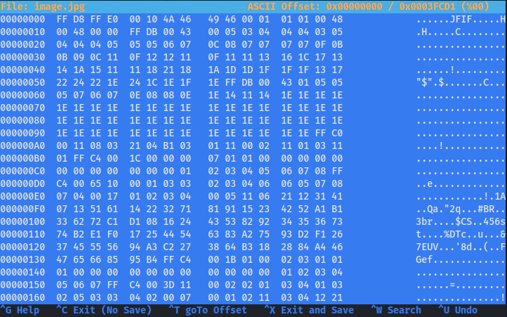

# Introduction to Digital Forensics

> The application of computer science and investigative procedures for a legal purpose involving the analysis of digital evidence after proper search authority, chain of custody, validation with mathematics, use of validated tools, repeatability, reporting, and possible expert presentation.  
> 
> Ken Zatyko

Simply put, digital forensics is a process of using technology to gather evidence, investigate it, and present the findings in a legal case. It can include going through network activity, access logs, search history, and digital storage media like hard disks and mobile devices, as well as the analysis of that data to identify evidence of criminal activity or other wrongdoing.

# Some use cases

**Investigating cyber attacks** — In case of a security breach or a cyber attack, digital forensics can be used to determine the scope, as well as the source of the attack. This information can then be used to improve the organization's defenses against future attacks.

**Threat detection and response** — It can be very useful to proactively identify and mitigate security threats.

**Data recovery** — Digital forensics can also be used to recover data that may have been stolen or deleted during an attack.

**Criminal Investigations** — The evidence collected can be used to identify suspects, establish motive, and link suspects to specific crimes.

The common goal includes collecting evidence that can be used to prosecute suspects in a court of law.

# Motivation

> You are leaving a trail, albeit a digital one; it's a trail nonetheless.  
>
>  John Sammons 

- **REvil Ransomware Group gets arrested in Russia**
    
    
    
    [Link to video](https://www.youtube.com/watch?v=OqEWuFmzhzs)
    
- **Author of Raccoon Stealer gets arrested in Netherlands**
    
    
    
    [Link to tweet](https://twitter.com/vxunderground/status/1587304651426332673)
    
- **How a Floppy Disk brought the BTK killer down**
    
    [Link to article](https://www.refinery29.com/en-us/2019/08/240899/btk-killer-caught-when-how-floppy-disk-dennis-rader)
    

# Linux command line fundamentals

This section serves as an introduction to the Linux command line tools which are essential for digital forensics.

There are many Linux commands that can be useful in forensics, but some of the most essential ones include:

## `ls` — used to list the files and directories in a directory

The ls command lets you see a list of all the files and folders in a specific folder

```
$ ls
Desktop  Documents  Downloads  Music  Pictures  Public  Videos
```

## `cd` — used to change the current working directory

The cd command lets you change the folder that you are currently working in.

```
$ cd Desktop/
```

## `cat` — used to display the contents of a file

The `cat` command (short for "concatenate") lets you print the contents of a file.

```
$ cat file.txt 
Hello World!
```

## `strings` — used to display the printable strings in a file

The `strings` command allows you to see human-readable strings of characters inside a file which is helpful in identifying any suspicious strings.

```
$ strings file.txt 
Hello World!
```

```
$ strings /bin/bash
/lib64/ld-linux-x86-64.so.2
 $DJ
CDDB
E`% 
`0 	
"BB1
B8: 
0D@kB
) 9E4
NR l
 "?$aD
!A8H
h% H0A
Hap5
($B 
d> 7
<SNIP>
```

## `grep` — used to search for a specific string or a pattern in a file or multiple files

The `grep` command is extremely useful for searching a string in large files, such as log files. It can speed up investigations dramatically by letting you search for patterns like URLs, E-mail addresses, MD5 hashes, and more.

```
$ grep "Hello" file.txt 
Hello World!
```

## `find` — used to search for files and directories

The `find` command can be used to locate different types of files, directories, files with specific permissions, recently modified files.

```
$ find . -type d
.
./Music
./Public
./Downloads
./Desktop
./.config
./.config/autostart
./.config/xfce4
./.config/xfce4/panel
./.config/cherrytree
./.config/powershell
./Pictures
./Documents
./.java
./.java/.userPrefs
./.java/.userPrefs/burp
./Videos
```

Notice how the output above returns a few more directories than the `ls` command.

## `md5sum`, `sha1sum` — used to compute the MD5 and SHA1 hashes of a file

Both of these commands take an input and generate a fixed-length string, also known as a hash or a checksum. If the contents of the file change, even slightly, its hash will be different. This can be useful for detecting if a file has been modified or tampered with.

```
$ md5sum file.txt 
8ddd8be4b179a529afa5f2ffae4b9858  file.txt
```

```
$ sha1sum file.txt 
a0b65939670bc2c010f4d5d6a0b3e4e4590fb92b  file.txt
```

## `netstat` — used to display information about the network connections on a system

This tool provides useful information about active connections on a system. The information displayed by this tool includes local and remote addresses and ports of active connections.

```
$ netstat
Active Internet connections (w/o servers)
Proto Recv-Q Send-Q Local Address           Foreign Address         State      
tcp        0      0 192.168.0.106:44300     239.237.117.34.bc:https ESTABLISHED
tcp        0      0 192.168.0.106:39884     93.184.220.29:http      ESTABLISHED
tcp        0      0 192.168.0.106:58308     ec2-52-39-122-167:https ESTABLISHED
tcp        0      0 192.168.0.106:56910     static-48-7-129-15:http ESTABLISHED
udp        0      0 192.168.0.106:bootpc    192.168.0.1:bootps      ESTABLISHED
```

## `file` — used to determine the type of a file based on its contents

The `file` command can be used to identify files such as text, image, audio, video, and executable files. It can also be used to identify unknown files that may potentially be malicious.

```
$ file /etc/passwd
/etc/passwd: ASCII text
```

```
$ file image.png 
image.png: PNG image data, 562 x 424, 8-bit/color RGB, non-interlaced
```

## `xxd` — used to print hex dump of a given file

The `xxd` command is useful to print hex dump of a given file or standard input. It can also convert a hex dump back to its original binary form.

```
$ xxd image.jpg 
00000000: ffd8 ffe0 0010 4a46 4946 0001 0101 0048  ......JFIF.....H
00000010: 0048 0000 ffdb 0043 0005 0304 0404 0305  .H.....C........
00000020: 0404 0405 0505 0607 0c08 0707 0707 0f0b  ................
00000030: 0b09 0c11 0f12 1211 0f11 1113 161c 1713  ................
00000040: 141a 1511 1118 2118 1a1d 1d1f 1f1f 1317  ......!.........
00000050: 2224 221e 241c 1e1f 1eff db00 4301 0505  "$".$.......C...
```

## `hexedit` — used to edit files in hexadecimal format

The `hexedit` tool lets you edit raw bytes of a file in an interactive way. It is often used for repairing corrupted files.

```
$ hexedit image.jpg
```



## `ps` — used to list the process running on the system

The `ps` command lets you see a list of all the processes that are currently running on your computer. The information it provides includes the process ID, user, state, and command that started the process.

```
$ ps                    
    PID TTY          TIME CMD
   1824 pts/0    00:00:09 zsh
   2879 pts/0    00:00:05 sublime_text
   2924 pts/0    00:00:00 plugin_host-3.3
   2927 pts/0    00:00:00 plugin_host-3.8
  22666 pts/0    00:00:00 ps
```

# Exercise

For this section, provide the complete commands for all the exercises where asked for the command, and provide a descriptive answer where asked for an explanation. There may be multiple answers/commands for these exercises, so feel free to submit the answer you feel most comfortable with.

## Questions

1. If we wanted to list all the `.txt` files in the current directory, what command would we want to use?
2. What command can we use to read the contents of the file `/etc/passwd`?
3. If we wanted to search for the string `Error` in all files in the `/var/log` directory, what would our command be?
4. What would be the commands to calculate MD5 and SHA1 hashes of the file `/etc/passwd`? 
5. Use the `file` command to determine the type of the file `/usr/bin/cat` and explain the output in 2-3 sentences.
6. What command can we use to display all printable strings of length ≥ 8 in the file `/bin/bash`?
7. Given the following output of the `file` command, can you determine what’s wrong with this file?
    
    ```
    $ file image.jpg
    image.jpg: ELF 64-bit LSB pie executable, x86-64, version 1 (SYSV), dynamically linked, interpreter /lib64/ld-linux-x86-64.so.2, BuildID[sha1]=3ab23bf566f9a955769e5096dd98093eca750431, for GNU/Linux 3.2.0, not stripped
    ```
    
8. If we wanted to look for files modified in the last 30 minutes in `/home` directory, what command would we want to use?  
Hint: Explore how you can use `find` command to achieve this.
9. What command can we use to display information about all active TCP connections on the system?
10. Given [this corrupted image file](files/challenge.png), can you find a way to recover and view its contents?  
Hint 1: A quick google search for “magic bytes” might help.  
Hint 2: Explore how `hexedit` can help you here.  
    
    You may download the image using following command:  
    ```
    curl https://raw.githubusercontent.com/vonderchild/digital-forensics-lab/main/Lab%2001/files/challenge.png -o challenge.png
    ```