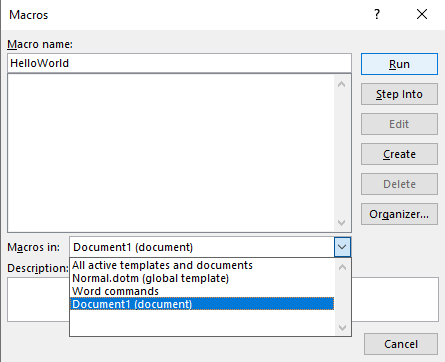
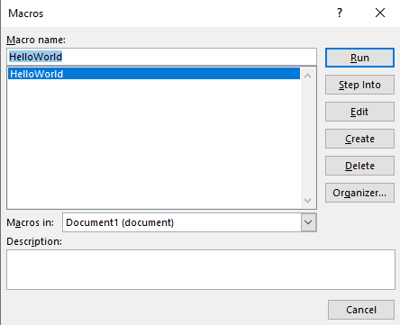

# Document Analysis and Steganography

Documents are a common way of sending or storing information like messages, reports, videos, or ideas. MS Office documents, Images, and audio files are some commonly used formats in our day-to-day lives. However, beyond what we see written in a word document or hear in an audio file, these documents can also contain hidden messages or malicious code that may execute when we open them. In this lab, we’ll explore some techniques to analyze and examine these documents.

# Microsoft Office Documents

There are two main file formats used by Microsoft Office documents:

- OLE (Object Linking and Embedding)
- OOXML (Office Open XML)

### OLE

OLE (Object Linking and Embedding) was the file format used in early versions of Microsoft Office between 1997 and 2003. It defined a “file within a file” structure which allowed other files to be embedded into a file. For example, an Excel spreadsheet could be embedded within a Microsoft Word document. 

It supported file extensions like `.rtf`, `.doc`, `.ppt`, and `.xls`, among others.

### OOXML

OOXML (Office Open XML) is the current file format used in Microsoft Office, which relies on an XML-based format for office documents. 

The extensions for these documents include `.docx`, `.pptx`, and `.xlsx`, among others. 

The OOXML format stores Office documents as ZIP containers. This means that the documents such as Word, Excel, and PowerPoint files, are actually just ZIP files. By renaming the extension from `.docx`, `.xlsx`, or `.pptx` to `.zip`, you can extract the contents of the archive and view the individual XML files. This is a useful feature for digital forensics, as it allows investigators to examine the contents of a document without modifying it.

## Anatomy of an OOXML document

To take an example, let’s create a word document with the text `Hello World!` in it, transfer it over to our Kali machine and then unzip it.

```
$ unzip Doc1.docx                       
Archive:  Doc1.docx
  inflating: [Content_Types].xml     
  inflating: _rels/.rels             
  inflating: word/document.xml       
  inflating: word/_rels/document.xml.rels  
  inflating: word/theme/theme1.xml   
  inflating: word/settings.xml       
  inflating: word/styles.xml         
  inflating: word/webSettings.xml    
  inflating: word/fontTable.xml      
  inflating: docProps/core.xml       
  inflating: docProps/app.xml
```

Here’s how the file structure of a Word document looks like:

```
.
├── [Content_Types].xml
├── docProps
│   ├── app.xml
│   └── core.xml
├── _rels
│   └── .rels
└── word
    ├── document.xml
    ├── fontTable.xml
    ├── _rels
    │   └── document.xml.rels
    ├── settings.xml
    ├── styles.xml
    ├── theme
    │   └── theme1.xml
    └── webSettings.xml
```

### **[Content_Types].xml**

This file contains information about the content types that are present in the document and their corresponding file extensions.

### 📂 docProps

This folder contains two files, `app.xml` and `core.xml`.

- `app.xml` — contains information about the application that was used to create the document.
    
    ```xml
    <?xml version="1.0" encoding="UTF-8" standalone="yes"?>
    <Properties xmlns="http://schemas.openxmlformats.org/officeDocument/2006/extended-properties" xmlns:vt="http://schemas.openxmlformats.org/officeDocument/2006/docPropsVTypes">
      <Template>Normal.dotm</Template>
      <TotalTime>0</TotalTime>
      <Pages>1</Pages>
      <Words>1</Words>
      <Characters>12</Characters>
      <Application>Microsoft Office Word</Application>
      <DocSecurity>0</DocSecurity>
      <Lines>1</Lines>
      <Paragraphs>1</Paragraphs>
      <ScaleCrop>false</ScaleCrop>
      <Company/>
      <LinksUpToDate>false</LinksUpToDate>
      <CharactersWithSpaces>12</CharactersWithSpaces>
      <SharedDoc>false</SharedDoc>
      <HyperlinksChanged>false</HyperlinksChanged>
      <AppVersion>16.0000</AppVersion>
    </Properties>
    ```
    
- `core.xml` — contains metadata of the document, such as the author’s name, creation date, and modification date.
    
    ```xml
    <?xml version="1.0" encoding="UTF-8" standalone="yes"?>
    <cp:coreProperties xmlns:cp="http://schemas.openxmlformats.org/package/2006/metadata/core-properties" xmlns:dc="http://purl.org/dc/elements/1.1/" xmlns:dcterms="http://purl.org/dc/terms/" xmlns:dcmitype="http://purl.org/dc/dcmitype/" xmlns:xsi="http://www.w3.org/2001/XMLSchema-instance">
      <dc:title/>
      <dc:subject/>
      <dc:creator>Saad Javed</dc:creator>
      <cp:keywords/>
      <dc:description/>
      <cp:lastModifiedBy>Saad Javed</cp:lastModifiedBy>
      <cp:revision>2</cp:revision>
      <dcterms:created xsi:type="dcterms:W3CDTF">2023-02-04T15:44:00Z</dcterms:created>
      <dcterms:modified xsi:type="dcterms:W3CDTF">2023-02-04T15:44:00Z</dcterms:modified>
    </cp:coreProperties>
    ```
    

### 📂 _rels

This folder contains one file named `.rels`.

- `.rels` — contains information about the relationships between the different parts of the document such as for `app.xml` and `core.xml`.

### 📂 word

This folder contains the actual content of the document.

- `document.xml` — contains the actual text of the document.
    
    ```xml
    <!-- SNIP -->
      <w:body>
        <w:p w14:paraId="68F74602" w14:textId="442B891B" w:rsidR="00D473D4" w:rsidRPr="00B20485" w:rsidRDefault="00B20485">
          <w:pPr>
            <w:rPr>
              <w:lang w:val="en-US"/>
            </w:rPr>
          </w:pPr>
          <w:r>
            <w:rPr>
              <w:lang w:val="en-US"/>
            </w:rPr>
            <w:t>Hello World!</w:t>
          </w:r>
        </w:p>
        <w:sectPr w:rsidR="00D473D4" w:rsidRPr="00B20485">
          <w:pgSz w:w="11906" w:h="16838"/>
          <w:pgMar w:top="1440" w:right="1440" w:bottom="1440" w:left="1440" w:header="708" w:footer="708" w:gutter="0"/>
          <w:cols w:space="708"/>
          <w:docGrid w:linePitch="360"/>
        </w:sectPr>
      </w:body>
    </w:document>
    ```
    
- `fontTable.xml` — contains information about the fonts used in the document.
- 📂 **_rels —** contains one file `document.xml.rels`.
    - `document.xml.rels` — contains information about the relationships between the different parts of the document, such as styles, themes, settings, as well as the URIs for external links.
- `settings.xml` — contains document settings and configuration information.
- `styles.xml` — contains information about the styles used in the document.
- 📂 **theme** — contains files about the theme used in the document.
    - `theme1.xml` — contains the actual theme content.
- `webSettings.xml` — contains information about the web-specific settings of the document, such as HTML frameset settings as well as how the document is handled when saved as HTML.

The information about any additional files that may be present in a document can be found on the link [http://officeopenxml.com/anatomyofOOXML.php](http://officeopenxml.com/anatomyofOOXML.php).

## Macro-Enabled Documents

Macro-Enabled documents are documents that contain macros, which are sets of instructions that automate tasks. Macros can be written in Visual Basic for Applications (VBA) and can be used to perform a wide range of tasks, such as formatting text, performing calculations, and automating complex processes. However, attackers often utilize this functionality of Office documents with a phishing attack and embed malicious macros to perform malicious actions and install malware on the system. 

The extensions for these documents include `.docm`, `.pptm`, and `.xlsm`, among others.

To take an example, let’s create an empty word document, and follow the steps below:

1. Click View → Macros → View Macros.
    
    
    
2. Type a name such as HelloWorld, select Document1 (current document) under Macros in, and click create.
    
    
    
3. Paste the following code in the text box.
    
    ```visual-basic
    Sub HelloWorld()
    
    Dim doc As Document
    Set doc = Word.ActiveDocument
    doc.Content.InsertAfter ("Hello, World!")
    
    End Sub
    ```
    
    
    
4. Close the Microsoft Visual Basic for Application tab.
5. Repeat step 1, select the HelloWorld macro and click Run.
    
    
    
6. Observe that `Hello, World!` is now written in the document.
7. Save the document as `.docm`.

As per the anatomy of OOXML files, the macro is now stored inside `word/vbaProject.bin`, however, we won’t be able to read it as it’s in binary form. But, we can use a collection of tools called `oletools` to analyze and extract macros from OLE files such as Microsoft Office Documents.

To install `oletools`, use the command: `sudo -H pip install -U oletools`.

Let’s use `oleid` to detect whether our document has any macros embedded in it.

```
$ oleid HelloWorld.docm   
XLMMacroDeobfuscator: pywin32 is not installed (only is required if you want to use MS Excel)
oleid 0.60.1 - http://decalage.info/oletools
THIS IS WORK IN PROGRESS - Check updates regularly!
Please report any issue at https://github.com/decalage2/oletools/issues

Filename: HelloWorld.docm
WARNING  For now, VBA stomping cannot be detected for files in memory
--------------------+--------------------+----------+--------------------------
Indicator           |Value               |Risk      |Description               
--------------------+--------------------+----------+--------------------------
File format         |MS Word 2007+ Macro-|info      |                          
                    |Enabled Document    |          |                          
                    |(.docm)             |          |                          
--------------------+--------------------+----------+--------------------------
Container format    |OpenXML             |info      |Container type            
--------------------+--------------------+----------+--------------------------
Encrypted           |False               |none      |The file is not encrypted 
--------------------+--------------------+----------+--------------------------
VBA Macros          |Yes                 |Medium    |This file contains VBA    
                    |                    |          |macros. No suspicious     
                    |                    |          |keyword was found. Use    
                    |                    |          |olevba and mraptor for    
                    |                    |          |more info.                
--------------------+--------------------+----------+--------------------------
XLM Macros          |No                  |none      |This file does not contain
                    |                    |          |Excel 4/XLM macros.       
--------------------+--------------------+----------+--------------------------
External            |0                   |none      |External relationships    
Relationships       |                    |          |such as remote templates, 
                    |                    |          |remote OLE objects, etc   
--------------------+--------------------+----------+--------------------------
```

The result shows that the tool found VBA Macros and evaluated the risk as medium. We can now proceed with using `olevba` to extract the macros from the document.

```
$ olevba HelloWorld.docm
XLMMacroDeobfuscator: pywin32 is not installed (only is required if you want to use MS Excel)
olevba 0.60.1 on Python 3.10.8 - http://decalage.info/python/oletools
===============================================================================
FILE: HelloWorld.docm
Type: OpenXML
WARNING  For now, VBA stomping cannot be detected for files in memory
-------------------------------------------------------------------------------
VBA MACRO ThisDocument.cls 
in file: word/vbaProject.bin - OLE stream: 'VBA/ThisDocument'
- - - - - - - - - - - - - - - - - - - - - - - - - - - - - - - - - - - - - - - 
(empty macro)
-------------------------------------------------------------------------------
VBA MACRO NewMacros.bas 
in file: word/vbaProject.bin - OLE stream: 'VBA/NewMacros'
- - - - - - - - - - - - - - - - - - - - - - - - - - - - - - - - - - - - - - - 
Sub HelloWorld()

Dim doc As Document
Set doc = Word.ActiveDocument
doc.Content.InsertAfter ("Hello, World!")

End Sub
No suspicious keyword or IOC found.
```

The output above shows that the extracted macro is exactly the same as we attached with the document.

# Steganography

The word steganography comes from the Greek word Steganographia, made up of two words “steganos” meaning “covered or concealed” and “graphia” meaning “to write”. It involves hiding secrets in an otherwise seemingly innocent piece of information. An early example of steganography is the use of invisible ink made from lemon juice or vinegar to write on paper and then reveal the writing by heating the paper.

In today’s digital world, steganography is used to hide a message within another file, like an image or audio file, in such a way that it can not be seen or heard by anyone who doesn't know it's there. This technique can be used for both innocent purposes, like sending a secret message to a friend, or for malicious reasons, like concealing evidence or communicating without detection.

> Today, digital steganography is one of the important components in the toolboxes of spies and malicious hackers, as well as human rights activists and political dissidents.
>  
> — Ben Dickson

The first recorded uses of steganography can be traced back to 440 BC in Greece, when Herodotus mentions two examples in his Histories. Histiaeus sent a message to his vassal, Aristagoras, by shaving the head of his most trusted servant, "marking" the message onto his scalp, then sending him on his way once his hair had regrown, with the instruction, "When thou art come to Miletus, bid Aristagoras shave thy head, and look thereon."

Source: Wikipedia

Some recent examples include:

- Malicious memes on Twitter — [Link to blog](https://www.trendmicro.com/en_us/research/18/l/cybercriminals-use-malicious-memes-that-communicate-with-malware.html).
- PDFs with malicious JavaScript code — [Link to article](https://securityaffairs.co/80342/hacking/steganography-obfuscate-pdf.html).

## Image Steganography

PNG and JPEG are two common image formats. They can also be used as a channel to hide messages inside them. Both these formats rely on different structures to construct an image, and therefore, different techniques are utilized to hide messages within them.

### PNG

For PNG files, one of the commonly employed techniques to hide messages is by modifying the least significant bits (LSBs) of certain pixels such as those who have minimal impact on the quality of the image. The algorithm then knows which pixels to extract the embedded message from.

As an example, consider the below image of Van Gogh’s Starry Night painting with a message already embedded in it.


The image can be downloaded from [https://github.com/vonderchild/digital-forensics-lab/blob/main/Lab 03/files/starry_night.png](https://github.com/vonderchild/digital-forensics-lab/blob/main/Lab%2003/files/starry_night.png).

One tool used for detecting PNG steganography is `zsteg`, which can be installed using the command `sudo gem install zsteg`. 

Here’s how we can use the tool to extract the hidden message:

```
$ zsteg starry_night.png           
b1,rgb,lsb,xy       .. text: "148:The fishermen know that the sea is dangerous and the storm terrible, but they have never found these dangers sufficient reason for remaining ashore."
b2,r,lsb,xy         .. file: OpenPGP Public Key
b4,g,lsb,xy         .. text: "*e~_^u|["
```

### JPEG

For JPEG files, a commonly used steganography method involves finding pairs of positions inside an image such that exchanging their values has the effect of embedding the corresponding part of the secret message. If no such pairs are found, the pixels in the remaining positions are simply overwritten.

With `steghide` tool, we can hide and extract messages out of JPEG files.


> 💡 Another tool to add to your digital forensics toolkit is `exiftool`, which can be useful in extracting metadata from files such as an image or an audio file, which includes information such as the creation and modification dates, author, and location of where an image was captured (latitude and longitude).


# Audio Steganography

In audio steganography, the most common method is to embed the message within the audio’s spectrum. However, this method makes the audio noisy. Another method is to embed the message within the least significant bits (LSBs).

To detect audio steganography, tools such as Sonic Visualizer or Audacity can be used.

To test it out, download the audio file from [https://github.com/vonderchild/digital-forensics-lab/blob/main/Lab 03/files/super_secret_audio.wav](https://github.com/vonderchild/digital-forensics-lab/blob/main/Lab%2003/files/super_secret_audio.wav). 

Next, open the file in Sonic Visualizer, and click Layer → Add Spectogram.


# Exercises

1. A phishing attack has been reported in your organization, where an employee received a malicious Word document in an email that appeared to come from a trusted source. The employee opened the document which had macros in it, resulting in the attacker gaining access to the employee’s computer. A secret which will reveal the attacker's identity, is embedded inside the macro code. You are tasked with analyzing the macro code and extracting the embedded secret. The secret has the format `flag{s0me_str1ng}`.

    The Word document can be downloaded from [https://github.com/vonderchild/digital-forensics-lab/blob/main/Lab 03/files/YearlyBonus.docm](https://github.com/vonderchild/digital-forensics-lab/blob/main/Lab%2003/files/YearlyBonus.docm).

2. A mole within the government has leaked top secret information to a spy. The mole, aware of spycraft techniques, used steganography to hide the information within an image, which he then slipped to his handler. The spy received the image and pasted it into a PowerPoint document, covering it with multiple random images to conceal it. One of our spies has gained access to the enemy spy's computer and recovered the PowerPoint document. Your mission is to extract the first image, extract the top secret information as well as the name and location of his source inside the government.

    The PowerPoint document can be downloaded from [https://github.com/vonderchild/digital-forensics-lab/blob/main/Lab 03/files/Presentation.pptx](https://github.com/vonderchild/digital-forensics-lab/blob/main/Lab%2003/files/Presentation.pptx).

3. Provided with the audio file from the Audio Steganography section, figure out how you can view the spectogram and recover the flag using Audacity. Submit a screenshot.

    The audio file can be downloaded from [https://github.com/vonderchild/digital-forensics-lab/blob/main/Lab 03/files/super_secret_audio.wav](https://github.com/vonderchild/digital-forensics-lab/blob/main/Lab%2003/files/super_secret_audio.wav).