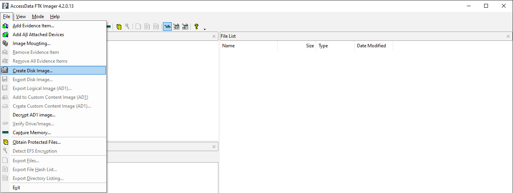
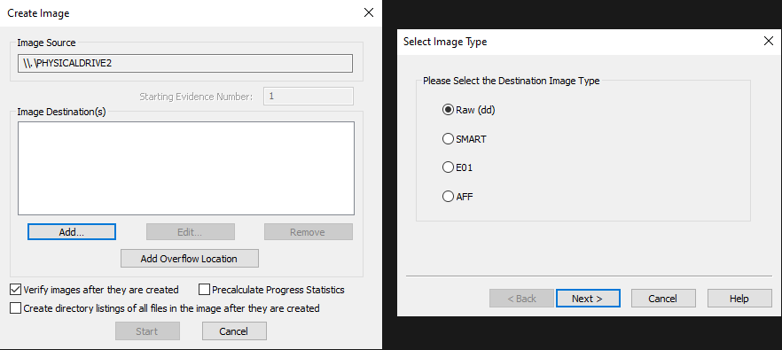
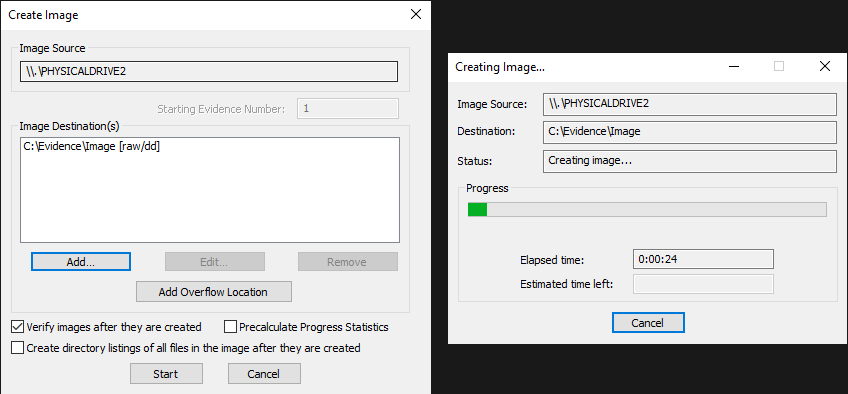
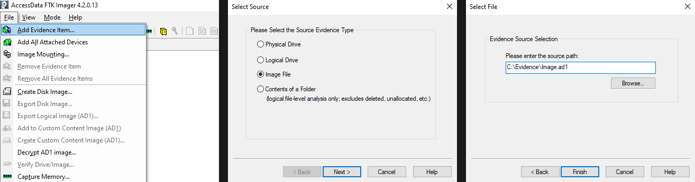

# Disk Image Forensics

Digital storage devices, such as hard drives, solid-state drives, and USB drives, hold vast amounts of data that can be crucial to digital forensics investigations. Disk image forensics is the process of analyzing these devices and their contents to look for useful information during an investigation.

In this lab, we will explore the basics of disk image forensics, including the basic terminology and the steps involved in acquiring and analyzing a disk image.

## Basic Terminology

### Disk Image

A disk image is a bit-by-bit copy of an entire disk (such as a hard drive, USB, etc.) or partition that preserves the exact content and structure of the original data. It includes not only the files and folders but also the empty space, metadata, and other hidden data that is not normally visible.

### Disk Imaging

Disk imaging is the process of creating a forensic copy of a storage device, such as a hard drive or USB drive. It is a crucial step in digital forensics because it ensures that the original data remains intact and unmodified. Cryptographic hashes are used to verify that the copy is exactly the same as the original, ensuring that no modifications have been made to the original data. This approach allows forensic investigators to work with the copy without worrying about accidentally altering the original data.

### Disk Image Forensics

Disk image forensics is the process of analyzing a disk image to search for evidence of interest. This includes using tools like Autopsy and FTK Imager to uncover useful information and analyze system artifacts like the windows registry, web browsers, LNK Files, event logs, command prompt history, etc.

There are several tools that can be used for disk image forensics, such as Autopsy and FTK Imager. While Autopsy offers more features during analysis, we'll be using FTK Imager for its lightweight nature. 

The tool can be downloaded from [https://www.exterro.com/ftk-imager](https://www.exterro.com/ftk-imager), so make sure you have installed FTK Imager on your computer before proceeding with the lab.

# Acquiring a Disk Image

Here's a step-by-step guide to create a disk image using FTK Imager:

1. Open FTK Imager, go to File → Create Disk Image.
    
    
    
2. Select Physical Drive, then click next and choose the drive you want to create an image of. For this example, I'll pick my USB drive.
    
    
    
3. Next, click the Add button under Image Destination(s). Then, select the destination image type as Raw (dd).
    
    
    
4. Enter the relevant details about the evidence, then choose a folder and a name to save the disk image.
    
    
    
5. Finally, click start to begin the creation process. It can take a little while to complete depending on the size of the drive.
    
    
    

# Analyzing a Disk Image

Once the disk image has been acquired, the next step is to analyze it for any evidence related to the investigation.

>💡 Although FTK Imager is lightweight, it requires us to have prior knowledge about the files that are present inside a disk image and their locations. On the other hand, Autopsy automatically parses useful information such as images, internet history, geolocation, timeline, etc. It can also recover deleted files, search for patterns within the disk image, and generate detailed reports. So I'll suggest you to explore it as well.

To download the disk image, use the link [https://github.com/vonderchild/digital-forensics-lab/blob/main/Lab 06/files/Image.ad1](https://github.com/vonderchild/digital-forensics-lab/blob/main/Lab%2006/files/Image.ad1).

To open a disk image in FTK Imager, click on "File" and then select "Add Evidence Item". From there, choose "Image File" and select the disk image you want to analyze:

Once you have opened the disk image on FTK Imager, you'll be able to see four sections on the window:

- Evidence Tree in the top left area, which displays the hierarchical layout of the disk image.
- Properties on the bottom left, which displays the metadata associated with the selected file, such as its name, last modify and access dates, md5 and sha1 hashes, etc.
- File List in the center towards the top, which displays the list of files and directories within the selected partition or image.
- Preview in the bottom, which displays the preview or hex contents of the selected file.

To be able to explore the file system in the disk image, we need to extend the evidence tree located in the top left area:

The root directory of the imaged USB Drive is displayed, allowing us to select and view the contents of any file. For instance, we can access and view the `note.txt` and `meme.jpeg` files that were originally stored on the USB drive.

We can also extract any of the files that may be of interest by simply right-clicking on them and selecting "Export Files".

### Some essential files in disk images

- **$MFT** — The Master File Table is an important file in NTFS file systems that stores information about all files and directories on a volume, including their names, permissions, and attributes. It also contains information about the location of each file on the disk.
- **$MFTMirr** — This file stands for MFT Mirror and serves as a backup of the $MFT, and is crucial in case the original $MFT becomes corrupted.
- **$LogFile** — This file records transaction journal information of metadata (MFT area), and can be used to recover from system crashes.

For analyzing these files, there are several tools available such as [analyzeMFT](https://github.com/dkovar/analyzeMFT), or [MFTECmd](https://github.com/EricZimmerman/MFTECmd) available for download at [https://ericzimmerman.github.io/#!index.md](https://ericzimmerman.github.io/#!index.md).

>💡 There may be a lot more files that may be present in a disk image like $Boot, $Secure, $Volume, etc. However, I encourage you to explore these on your own as part of your learning process.

# Conclusion

In this lab, we covered some basic terminology, then moved on to learning how to acquire a disk image. After that, we explored some commonly found files in a disk image and even did a basic analysis using FTK Imager. However, it's important to keep in mind that the disk image we analyzed was a small USB drive and there is much more to analyze in a larger hard drive disk image. This may require looking for common artifacts, such as the Windows Registry, Browser History, Event Logs, Console History, and anything which may provide valuable insights for the investigation.

# Exercises

Utilize the disk image from the section [Analyzing a Disk Image](#analyzing-a-disk-image) to answer the following questions:

1. What are the MD5 and SHA1 hashes of the `note.txt` file?
2. What's the MFT record number of the `note.txt` file? The answer may vary depending on the method used.
3. Can you determine the parent directory of the file named `$Txf`? You can use either analyzeMFT or MFTECmd to inspect the contents of the `$MFT` file to answer this question.
4. The `meme.jpeg` image was originally downloaded from a twitter URL. Can you use MFTECmd to determine the original URL? 
5. Can you analyze the `$Boot` file and determine the volume serial number in raw hexadecimal format?